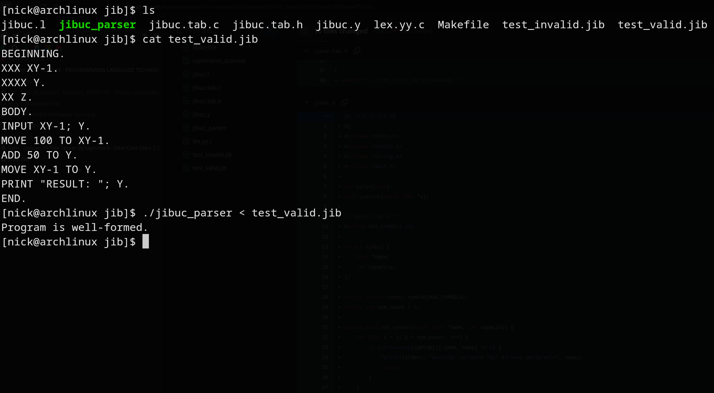
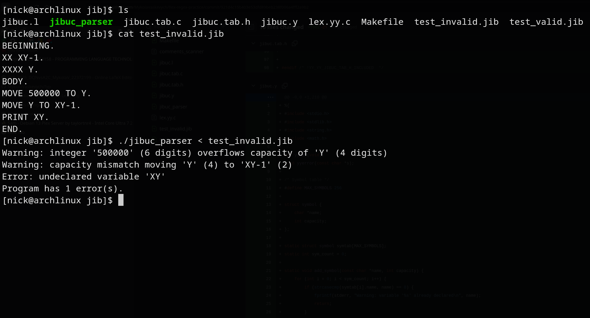

# JIBUC Parser

Parser and lexical analyser for the JIBUC programming language, built with Flex and Bison.

## Requirements

- GCC
- Flex
- Bison

## Compile

```
make
```

## Run

```
./jibuc_parser < program.jib
```

## JIBUC Syntax

```
BEGINNING.
<declarations>
BODY.
<statements>
END.
```

**Declarations:** `<X's> <identifier>.` — X count defines max digits (e.g. `XXX` = 3 digits).

**Statements:**

- `MOVE <integer|identifier> TO <identifier>.`
- `ADD <integer|identifier> TO <identifier>.`
- `INPUT <identifier>; <identifier>; ...`
- `PRINT <string|identifier>; <string|identifier>; ...`

## Examples

### Valid program (`test_valid.jib`)



### Invalid program (`test_invalid.jib`)


